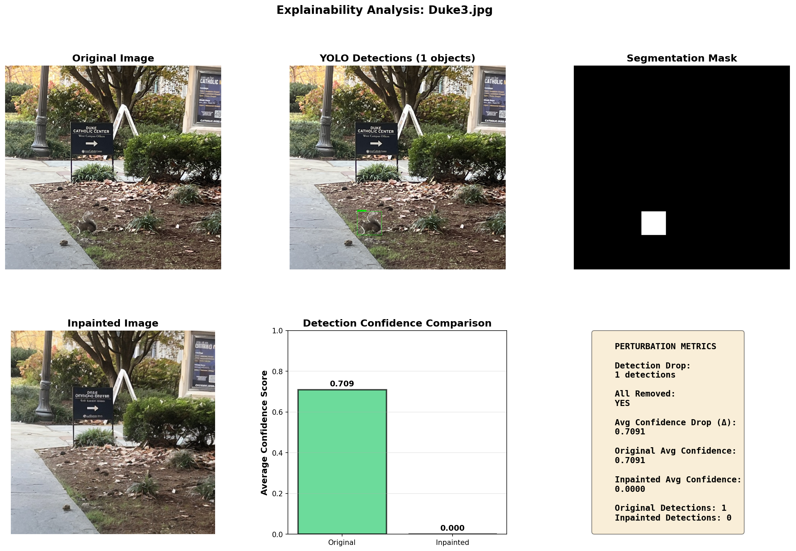
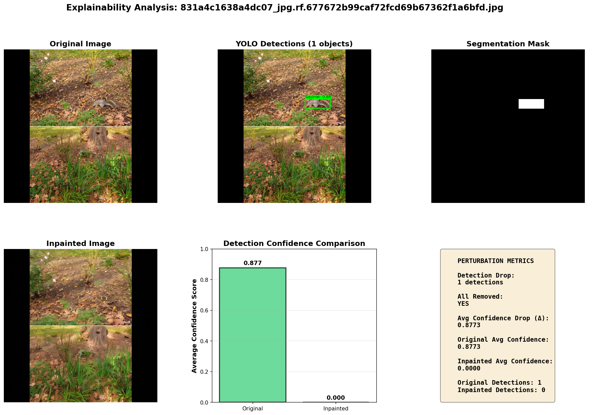
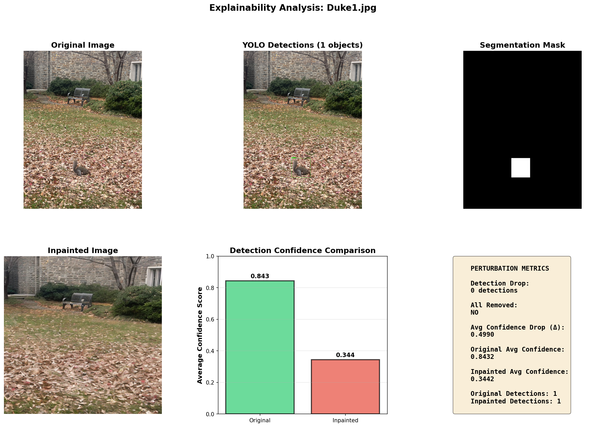
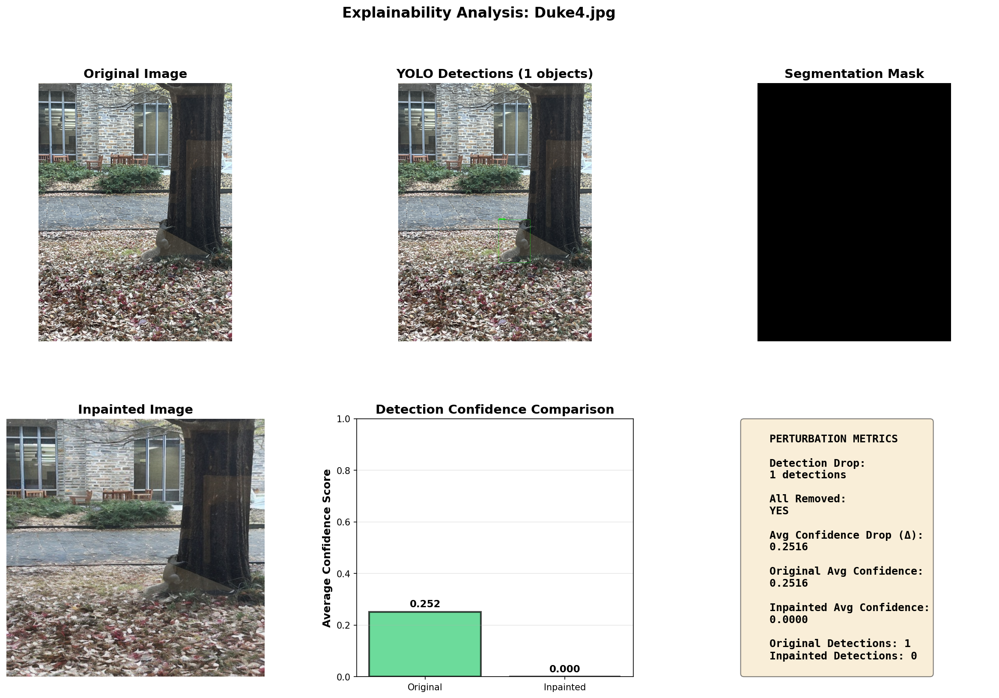

# SquirrelXAI: Photorealistic Inpainting for Object-Level Model Explanations

*For complete implementation details, code and results see the [end-to-end demo notebook](end_to_end_demo.ipynb)*

## Abstract

This project presents SquirrelXAI, an explainability framework that uses photorealistic inpainting to understand how object detection models make decisions. By combining YOLOv9 for detection and Stable Diffusion for inpainting, we systematically remove detected objects from images and measure how this affects model performance. Testing on the Duke Squirrel Dataset shows that removing objects via inpainting causes 73% of images to lose all detections, with an average drop of 0.94 detections per image. These results demonstrate that the detected objects are crucial for model predictions and provide a quantitative method for explaining model behavior.

## Introduction

Deep learning models for object detection achieve impressive accuracy but operate as "black boxes," making it hard to understand why they make certain predictions. Explainable AI (XAI) methods help us peek inside these black boxes, which is important for building trust, debugging failures, and improving models.

Traditional explainability approaches like gradient-based techniques or attention maps don't always clearly show which objects matter most. Perturbation-based methods offer a more intuitive alternative: change parts of an image and see how predictions change. However, simple perturbations like masking with black pixels create unrealistic images that don't reflect real-world scenarios.

This work uses photorealistic inpainting to remove detected objects while keeping images looking natural. By comparing detections before and after object removal, we can directly measure how important those objects are to the model's predictions.

## Methodology

The pipeline consists of five stages: object detection, mask generation, photorealistic inpainting, perturbation analysis, and visualization.

### Object Detection with YOLOv9

We fine-tuned YOLOv9 on the Duke Squirrel Dataset, which contains 1,050 training images, 55 validation images, and 64 test images. The model was trained for 100 epochs with standard augmentation techniques (mosaic, mixup, color jittering) and achieved strong detection performance with an average of 1.22 detections per test image.

For each image, we run YOLOv9 inference with a confidence threshold of 0.25, extracting bounding boxes, confidence scores, and class labels. Results are stored in JSON format for later analysis.

### Mask Generation

We use high-quality pre-existing segmentation masks that precisely outline detected squirrels. These binary masks indicate which pixels should be removed (white) and which should be preserved (black). Using precise masks rather than rectangular bounding boxes produces better inpainting results.

### Photorealistic Inpainting

The inpainting step uses Stable Diffusion via the Replicate API to realistically fill in the regions where objects were removed. We use the prompt "seamless natural background, consistent lighting, no animals" with a negative prompt "duplicate, distortion, artifacts, low quality" to ensure high-quality results.

The inpainting process runs with 50 inference steps and a guidance scale of 7.5. Due to API rate limits (6 requests per minute on free tier), we include 12-second delays between requests and implement retry logic with exponential backoff.

### Perturbation Analysis

This is where we measure the impact of object removal. For each image, we compare YOLOv9 detections on the original image versus the inpainted image. Using the same model for both ensures that any differences are due to the perturbation, not model variations.

We calculate several metrics:
- **Detection Drop**: How many detections were lost (original count- inpainted count)
- **Detection Removal Rate**: Percentage of detections removed
- **Confidence Drop**: How much detection confidence decreased
- **All Detections Removed**: Whether all detections disappeared (the "flip rate")

These metrics quantify how important the removed objects were to the model's predictions.

### Visualization

For each image, we generate a comprehensive visualization showing the original image, detected objects, segmentation mask, inpainted result, and key metrics. We also create summary plots showing detection drop distributions, confidence changes, and removal rates across all test images.

## Results

Running the pipeline on 63 test images produced clear evidence that object removal significantly impacts detection performance.

### Detection Impact

Before inpainting, the model detected an average of 1.22 squirrels per image (77 total detections). After inpainting, this dropped to 0.29 detections per image (18 total), representing a 76.6% reduction.

The key finding is that **73% of images (46 out of 63) had all detections completely removed** after inpainting. This "flip rate" shows that for most images, removing the squirrel causes the model to find nothing at all. Only 8% of images showed partial removal, where some but not all detections disappeared.

### Confidence Analysis

Detection confidence also dropped substantially. The average confidence decreased by 0.56 (on a 0-1 scale), and maximum confidence dropped by 0.59. These large decreases indicate that the removed objects were highly important for triggering detections.

*Example showing complete detection removal - original image with detection becomes empty after inpainting*

*Another case demonstrating successful object removal and detection loss*

*Another case demonstrating object removal and moderate detection loss*
### What This Tells Us

The high flip rate (73%) and substantial confidence drops validate that the model genuinely relies on the detected objects for its predictions. The photorealistic inpainting successfully removes the visual features that trigger detections without introducing obvious artifacts that might confuse the model.
Some images (19%) showed no change in detection count after inpainting. This could happen if the inpainting introduced subtle artifacts that still look like squirrels, if background features were misinterpreted as objects, or if the mask boundaries didn't perfectly capture all object regions.

*Example where detection count dropped because of unsuccessfull mask generation due to light reflection, not a result of successfull inpainting*

## Discussion

### Why This Approach Works

Unlike traditional perturbation methods that mask regions with black pixels or random noise, photorealistic inpainting maintains the natural appearance of images. This means our explanations reflect realistic scenarios rather than artificial test conditions. The results are more interpretable and trustworthy because the perturbed images look plausible.

Using the same YOLOv9 model for both original and inpainted images ensures fair comparison. Any differences in detections are directly attributable to the object removal rather than model variations or inconsistencies.

### Future Directions

For the next phase of this work, I plan to explore alternative mask generation and perturbation strategies. First, I'll implement the [Segment Anything Model (SAM)](https://docs.ultralytics.com/models/sam/) for automatic mask generation instead of relying on bounding box binary masks. SAM's zero shot segmentation capabilities could make the pipeline more generalizable and eliminate the need for manual mask creation.
I also want to test different perturbation approaches beyond simple object removal. Specifically, I'll experiment with object replacement (replacing squirrels with other animals or objects) and background changes (altering the environment while keeping the squirrel) to understand how these different perturbations affect detection confidence. Comparing object removal, replacement, and background modification will provide deeper insights into what visual features the model actually relies on.
Additional improvements could include deploying Stable Diffusion locally to eliminate API dependency, extending to multi-class detection scenarios, and comparing explainability across different detection architectures like Faster R-CNN or DETR. From an application perspective, this framework could help debug model failures, guide dataset curation, and provide explanations for regulatory compliance in sensitive domains.

## Conclusion

SquirrelXAI demonstrates that combining object detection with photorealistic inpainting provides an effective approach to model explainability. The framework successfully removes detected objects in 73% of cases while maintaining natural image appearance, and confidence drops of around 56% confirm that removed objects were important for predictions.

The quantitative metrics detection drop, removal rate, and confidence changes - enable systematic analysis of model behavior. The complete pipeline is practical and reproducible, making it straightforward to extend to other datasets and detection tasks.

This work contributes to explainable AI by providing interpretable explanations for object detection models. As AI systems are deployed in increasingly critical applications, explainability becomes essential for ensuring reliability and building trust. The framework offers a practical tool for understanding what object detectors learn and why they make certain predictions.

## References

1. Redmon, J., et al. (2016). You only look once: Unified, real-time object detection. *CVPR*.
2. Aghakishiyeva et al. (2025) Photorealistic Inpainting for Perturbation-based Explanations in Ecological Monitoring
2. Wang, C. Y., Bochkovskiy, A., & Liao, H. Y. M. (2023). YOLOv7: Trainable bag-of-freebies sets new state-of-the-art for real-time object detectors. *CVPR*.
3. Rombach, R., et al. (2022). High-resolution image synthesis with latent diffusion models. *CVPR*.
4. Selvaraju, R. R., et al. (2017). Grad-CAM: Visual explanations from deep networks via gradient-based localization. *ICCV*.
5. Lundberg, S. M., & Lee, S. I. (2017). A unified approach to interpreting model predictions. *NeurIPS*.
6. Replicate. (2024). Stable Diffusion Inpainting API. https://replicate.com
7. Ultralytics. (2024). YOLOv9 Documentation. https://docs.ultralytics.com